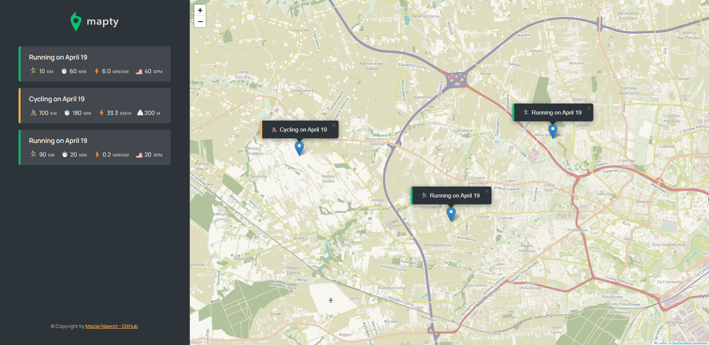

# Mapty
Website - [https://mapty-mn.netlify.app](https://mapty-mn.netlify.app)

## Table of contents
* [General info](#general-info)
* [Screenshots](#screenshots)
* [Technologies](#technologies)
* [Features](#features)
* [Setup](#setup)

## General info
This project is a training app that allows you to add your running and cycling workouts on a map.

## Screenshots

	
## Technologies
Project is created with:
* JavaScript
* CSS
* HTML

## Features
Basic features of the application:
* using the [leaflet.js](https://leafletjs.com) library to use the map in the application
* marking your workouts on a worldwide map with the ability to add additional information such as pace, distance, etc. 
* selecting a workout from the list with automatic shift to the place marked on the map
* keeping the results after exiting the application

## Setup
To run this project, install it locally using npm:
```
$ npm install
$ npm start
```
